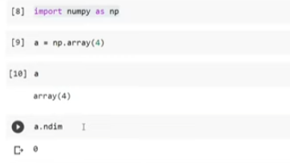
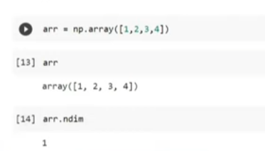
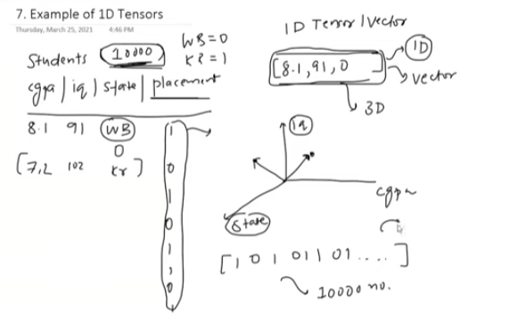
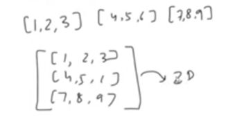
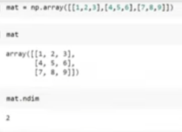
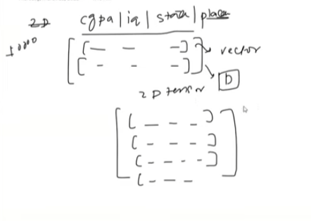
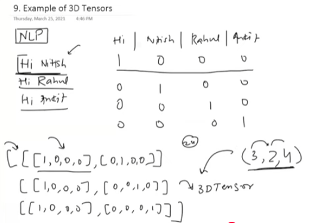
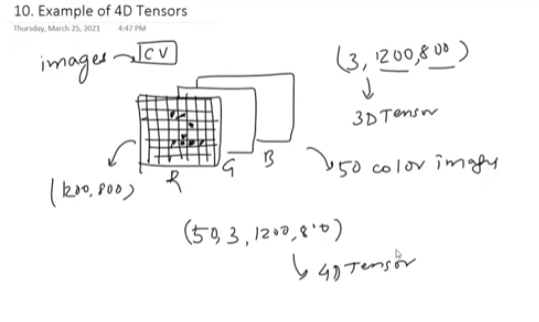
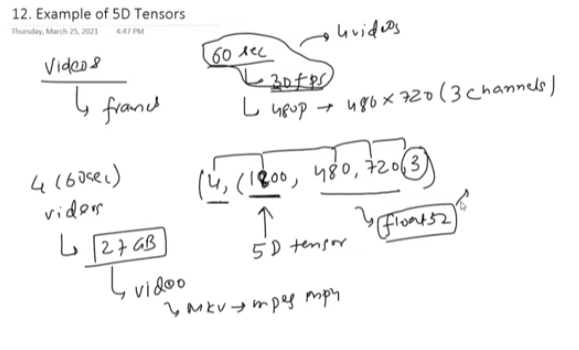
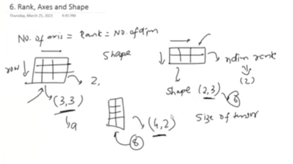

  Day 11 : What are Tensors 

- Tensors are data structure. 
- It helps to store the data.

- it is a container which helps to store the numbers.

## 0D Tensor / Scalar :

- 1 2 3 like no.

## 1D Tensor / Vector :

- [1,2,3,4]
- No of axis = No of _D of tensor/vector.
*** Note***
  - 1D tensor = vector 
  - v = [1,2,3,4]
  - this is 1D tensor = vector but,
  - this vector is 4D
  - means no of elements in vector that many dimensions of the vector

 
- each row of the table is 1D tensor / vector
- the graph represents the vector how it is 3D in nature.
- each vector is represented in the graph.
 

## 2D Tensor / Matrix : 

- Collection of 1D tensor/row of the table is 2D tensor.  

## ND Tensor : 

- 3D tensors are used in Time Series

## Rank , Axis & Shape

