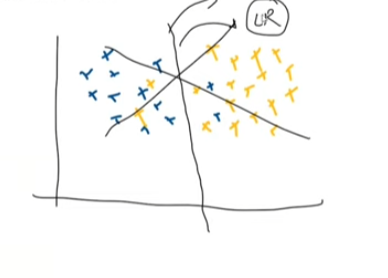

##  Day 13 End to End Project

# Logistic Regeneration Technique

* Here we plot the graph of the given data 
* We show that one line is separating  the placement is done or not 
* Here the line from the middle is separating the data 
* this is called the ***Logistic Regeneration Technique***
