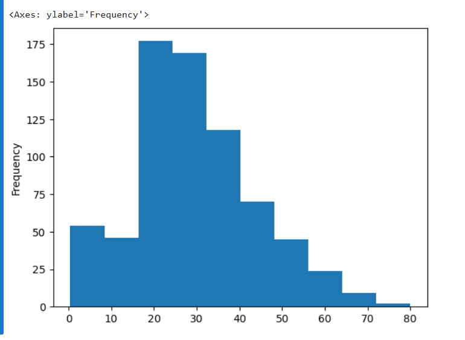
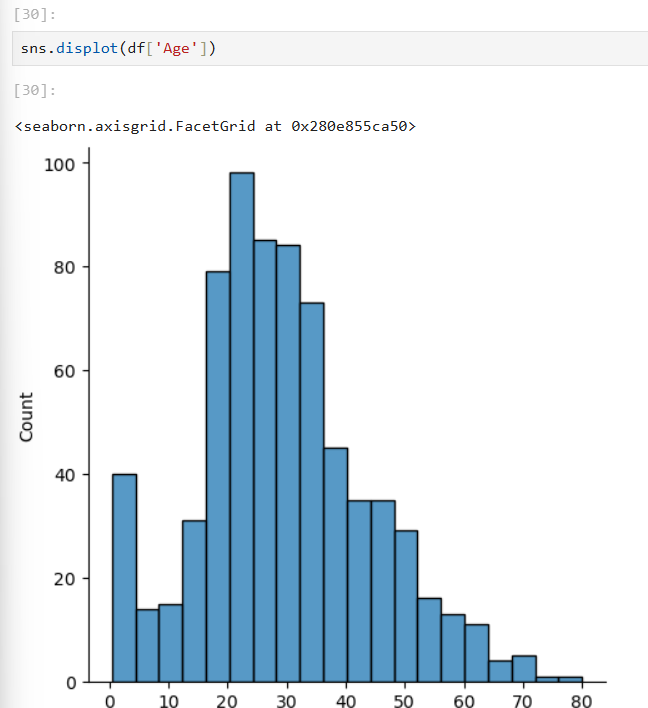
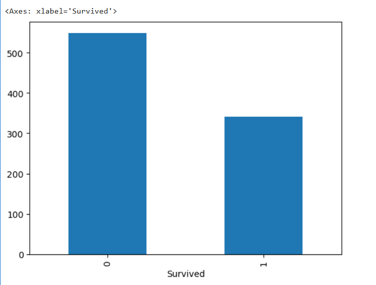
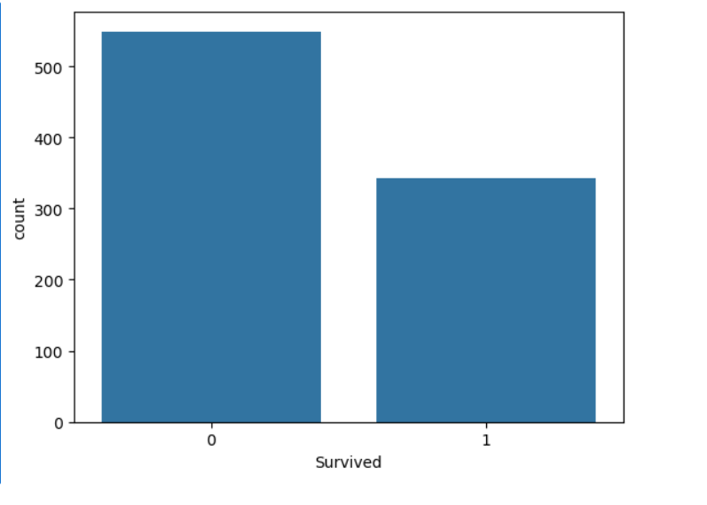
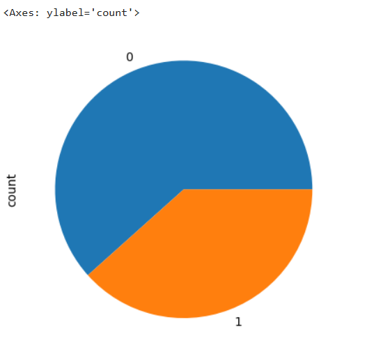
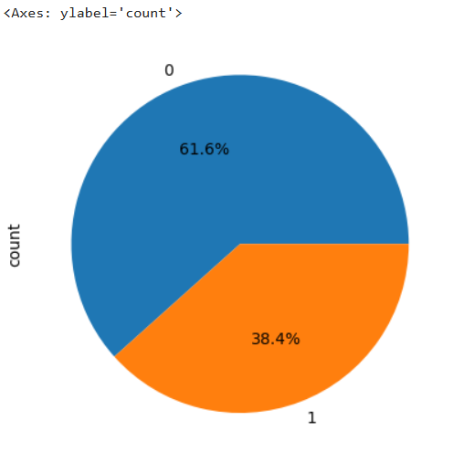

# Day 20  EDA - Exploratory Data Analysis

- It has multiple ways to do : 
  - Uni variate Analysis
  - Bi variate Analysis
  - Multivariate Analysis

## Uni variate Analysis

- We are analyzing particular column
- Analyzing a single variable (Column)
- Understand the distribution of data

## Bi variate Analysis

- Analyzing two columns
- Understand the relationship between two variables (Columns)

## Multivariate Analysis

- Analyzing more than two columns
- Understand the relationship between multiple variables (Columns)

# Type of the DATA

-----------------

## 1.Numerical Data 

* It is numeric in nature
* Ex : Age, Salary, Height, Weight, etc

### Visualizations for Numerical Data

* There are mainly two types of visualizations for numerical data:

###   1. Histogram : it shows the distribution of numerical data into the bins

   
      df['Age'].plot(kind = 'hist')

-----------

    df['Age'].plot(kind = 'hist' , bins = 20)

-----------

### 2. DistPloat : it shows the distribution of numerical data with a smooth curve

        import seaborn as sns
        import matplotlib.pyplot as plt
    
        sns.distplot(df['Age'])
        

### 3. Box Plot : it shows the summary of numerical data through five main statistics (minimum, first quartile, median, third quartile, and maximum)

        import seaborn as sns
        import matplotlib.pyplot as plt

        sns.boxplot(df['Age']) 

## 2.Categorical Data

* It is non-numeric in nature
* Ex : Gender, City, Country, etc

### Visualizations for Categorical Data

* There are mainly two types of visualizations for categorical data:

###   1. Bar Plot 

    df['Survived'].value_counts().plot(kind = 'bar')

------------

###   2. Count Plot

    import seaborn as sns
    import matplotlib.pyplot as plt
------------
    sns.countplot(x='column_name', data=df)
    plt.show()

------

### 2. Pie Chart

    df['Survived'].value_counts().plot(kind = 'pie' ) 

------------

    df['Survived'].value_counts().plot(
    kind='pie',
    autopct='%1.1f%%',   # shows percentage
    )

------------

