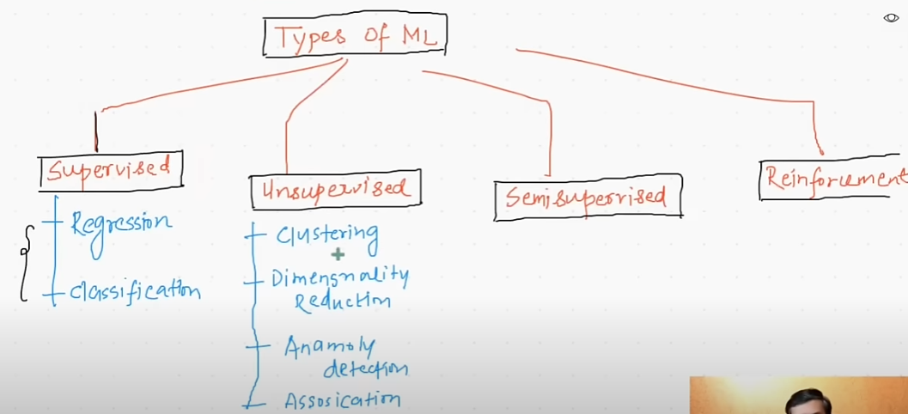
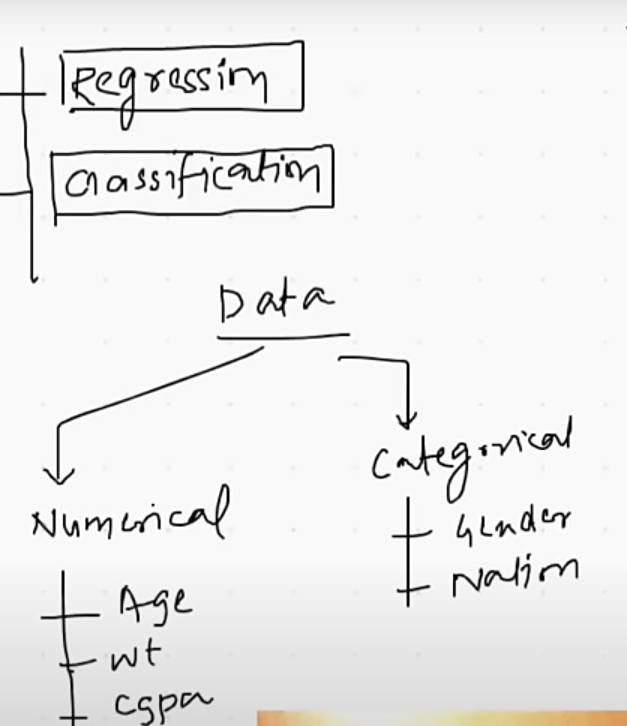
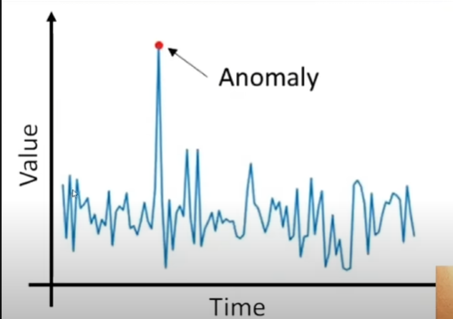

# Day 3 : Types of Matching Learning

------

## 1. Supervised ML :

------

- In this we provide the ***input and output*** both. 
- Based on that, it will get trained.

Ex : we provide the IQ , CGPA , PLACEMENT : done or not

- Where i/p : IQ and CGPA and o/p : Placement
    - I provide the 5000 students information to mode
    - now my model is get trained 
    - if I provide IQ and CGPA to the model, it can predict Placement possible or not.

### Types of the Supervised ML : 

  * 1 )  Regression 
    * The o/p of the model is numerical value is called Regression.
  * 2 )  Classification
    * The o/p of the model is categorical value  is called Classification.

## 2. Un-Supervised ML:

---------
  
* Here we have only input field we have to train modal and generate the output.
* We generate the o/p based on 4 ways:
  * i.  Clustering
  * ii. Dimensionality Reduction  
  * iii. Anomaly Detection
  * iv.  Association Rule Learning
  

---------
###  1. Clustering

- Here we plot the data into the graph and we make the group of the nodes. 
- These groups like:
  - high IQ and CGPA 
  - high IQ and low  CGPA
  - low  IQ and high CGPA
- based on this clustering, we provide the o/p.  

---------
###  2. Dimensionality Reduction  

- Here we reduce the similar columns.
- if the data has 10000 of column it s difficult to handel
- so we try to Reduce the similar columns 
- Ex : we are creating a house
  - it has ***No of rooms*** and ***No of Washroom*** column, so we may reduce it.
  
- Another use in Visualization : If we have 1000 X 1000 data, we have to plot no graph, it is difficult to plot.
  - So by reducing, we can take into 2D or 3D graph.

- We will learn in future PLA : Perceptron Learning algorithm.

---------
###  3. Anomaly Detection

- We find any un-even this then we call it an Anomaly.
- We remove it from the data.

* the green cross on the lower side is un-even than others, so it is an anomaly.

---------
###  4. Association Rule Learning

- It helps how to organize the similar data.
- Ex : I D-mart the chocolate section is beside the Biskit section always.
  - Because  it is sown when people by one of the then it get attracted to the other one.

- Ex : In the USA, the employee of one of the supermarkets notice that people when buy Baby diaper they also buy Bear.
  - So he suggested to keep bear beside the baby diaper. 
  - Sale got boomed !!

-------------------
## 3. Semi-Supervised ML :

- It is a combination of supervised and un-supervised.
- To create the output column/labels, we require the cost.

- so we think and decide we label only a few things based on that it will work.

- Ex : Google Photos : once it will ask who is this person we define : dad , mom , brother
  - behind the seen it gather the photos based on the label.

-------------------
## 3. Re-Enforcement ML :

Reinforcement Learning (RL) is a type of machine learning where an "agent" learns to make decisions by interacting with an "environment" to maximize a cumulative "reward". The agent is not explicitly programmed with the optimal solution but rather learns through trial and error, receiving feedback in the form of rewards or penalties.

Here are the key components of Reinforcement Learning:

- Agent: The learner or decision-maker.
- Environment: The external system with which the agent interacts.
- State: A specific configuration or situation of the environment at a given time.
- Action: A move or decision made by the agent within the environment.
- Reward: A numerical signal received by the agent after performing an action, indicating the desirability of that action and the resulting state. Positive rewards encourage certain behaviors, while negative rewards (penalties) discourage them.
- Policy: The strategy that the agent uses to determine its actions based on the current state. The goal of RL is to learn an optimal policy that maximizes the total reward over time.

- Example: Teaching a Dog to Fetch
Imagine you are teaching a dog (the agent) to fetch a ball in a park (the environment).
Initial State: The dog is sitting, and the ball is on the ground.

- Action: You throw the ball. The dog, initially, might not know what to do. It might sniff the ball, or run around randomly.

- Reward/Penalty:
If the dog brings the ball back to you and drops it, you give it a treat (a positive reward). This reinforces the desired behavior.
If the dog ignores the ball or runs away with it, you might offer no treat or a verbal "No!" (a negative reward or penalty). This discourages undesired behavior.

- New State: The dog is now either sitting with the treat, or you are trying to retrieve the ball from it.

- Learning: Through repeated trials, the dog learns that bringing the ball back results in a treat, and this positive reinforcement shapes its policy – the strategy of fetching the ball when thrown. Over time, the dog consistently performs the fetch action to receive the reward.

