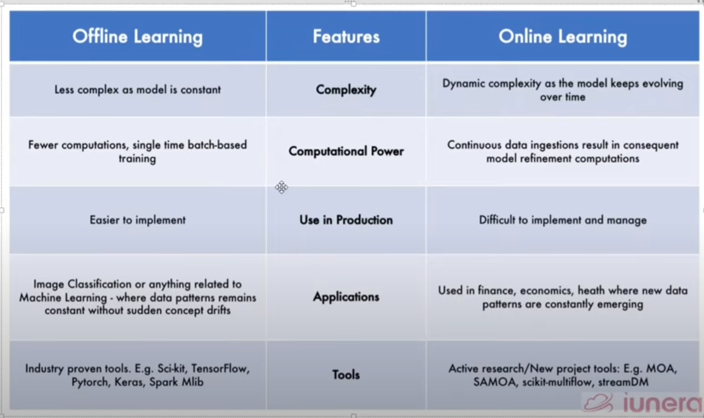

# Batch / Offline Machine Learning 

----------------
- We are training the Modal at the development level.
- we train modal will whole/large data.
- no incremental training is done.

 
- We prefer to train the modal with  large data  at OFFLINE.

## Problem of Batch Learning :

- here our modal is static.
- Ex : we create the movie recommendation system for the Netflix.
  - here if we deploy the modal today.
  - up to next month, Netflix may add some movies so that movies are not recommended by the Modal.
  - we have to Retrain  the modal every time and deploy again.

- We are getting the data of users daily on the basis of periodically (24 hours, weekly, monthly...) we do,
- We merge old + new data and again train the modal and deploy it.

## Dis-Advantages of Batch Learning :

### 1. Lots of Data :

- if our new data is getting 2x , 3x or 4x...
- it is difficult to train our modal with whole data.

### 2. Hardware Limitations :

- If in the low internet connectivity region, we can't get frequent updates of our modal
- Ex : we create the modal of army, and we use in Ladakh , Kashmir places...

## 3. Availability :

- we kept the retraining period of 24 hours 
- and some news like de-Monetization happen then we get the update in modal after 24 hours

