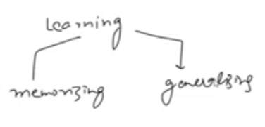
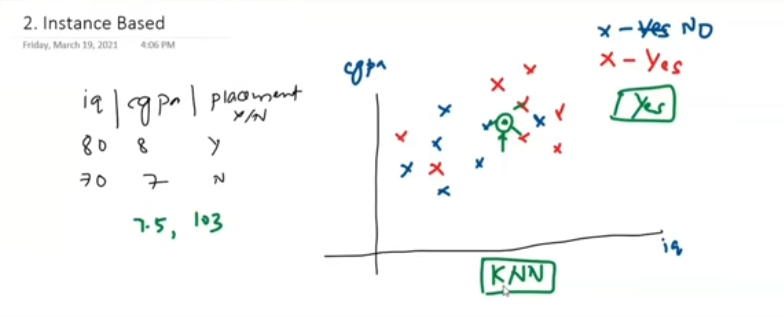
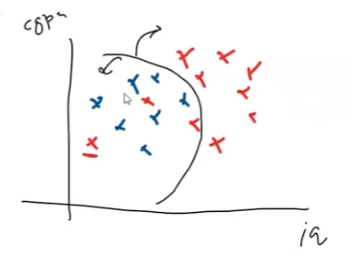
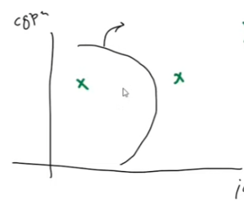
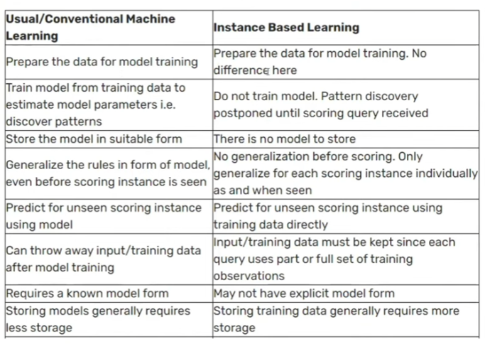

# Day 6 : Instance Vs Model-Based Learning

--------------------

### Learning Types :

1. ***Memorizing*** : Gokhi nakhvu.
   - Ex : Chemistry 

2. ***Generalizing*** : understand the concept.
   - Ex : Physics 
-------------

## Instance-Based Learning : 

- This is memorizing type of learning.
- it is also called ***lazy learning***.

- here in the training phase, we store the training data.
- we don't train the model.
- when some new data comes, we compare it with the training data and predict the output.
- Ex : KNN (K-Nearest Neighbor) Algorithm.

- in the image, the Green color is a new data point.
- we find the nearest neighbor of the new data point.
- here one nearest neighbor is blue color, and two nearest neighbors are red color.
- so we predict the output as red color. - yes, placement is correct. 

* Ex : KNN , SVM, Decision Tree. (Learn in future)

## Model-Based Learning :

- This is generalizing type of learning.
- here when we provide the data set, it tries to understand the behavior of the data.
- based on the understanding, it creates a boundary.
- when some new data comes, it checks in which boundary it lies and predicts the output.

- we ***create the equation of the boundary.***
- Ex : Logistic Regression, Linear Regression, Neural Network.

| we created the Boundary  | We don't require the Query points |
|-------------------------|-----------------------------------|
|  |            |

- here the Green color is a new data point.
- it checks in which boundary and predicts the output.

## Difference between Instance-Based and Model-Based Learning :

