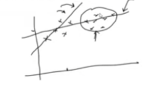

# Day 7 : Challenges in ML

------------------

## 1. Data Collection :

- It is difficult to collect the data.
- Ex : we want to create the disease prediction system.
- It is difficult to collect the data of patients.
- It is difficult to collect the data of rare diseases.
-  Other options :
    - Collect the data from the web API's.
    - Use web scraping to collect the data.

## 2. Insufficient Data / Labeled Data :

- It is difficult to get sufficient data.
- if we have m1 modal and m2 modal.
- M1 modal has 100 rows of data and M2 have 10000 rows of data.
- M2 modal will perform better than M1 modal.
- It is difficult to get labeled data.

## 3. Non-Representative Data :

- The data we have is not representative of the real-world scenario.
- If we have half story, and we have to give the conclusion of the story, it is mostly wrong.

- in the below image , the first slope is showing the half story and the second slope is showing the full story.

***Sampling Noise***
- The data we have is not representative of the real-world scenario.
- Ex : we are the collect data for who will win the cricket match.
  - we ask only Indian people.
  - due to loyalty towards India, they will say India will win.
  - but it is not the correct way to gather the data.
  - We have to ask the people of all countries.

***Sampling Bias***
- The data we have is not representative of the real-world scenario.
- Ex : we are the collect data for who will win the cricket match.
  - we ask now all the countries.
  - but in that country also lives india fans, they will say India will win.
  - but it is not the correct way to gather the data.
  - We have to ask the people who are not biased.

## 4. Poor Quality Data :

- The data we have is not of good quality.
- Ex : we have the data of students.
  - but some students have not filled the form correctly.
  - some students have filled the form with wrong data.
  - some students have filled the form with missing data.
- So we have to spend a lot of time in data cleaning.

## 5. Irrelevant Features :

***Garbage In , Garbage Out***
- means if we provide the garbage data to the model, we will get the garbage output.

- The data we have is not relevant to the problem we are trying to solve.

## 6. Overfitting :

- It is difficult to generalize the model.
- The model performs well on the training data but poorly on the test data.

- Ex : I go to watch the movie in the Ahmedabad city.
  - I asked the theater price of the movie, he replied 1200 rs.
  - so I assumed that the ahmedabad city is a very expensive city.
  - ***But this is not the correct way to assume.***

## 7. Underfitting :

- The model is too simple to capture the underlying pattern of the data.
- The model performs poorly on both the training data and the test data.

## 8. Software Integration :

- It is difficult to integrate the model into the existing software system.
- Ex : we create the model in python.
  - but the existing software system is in java.
  - So we have to convert the model into java.
  - It is difficult to deploy the model into the production environment.

## 9. Offline Learning and Deployment :

- The model is trained on the development side.
- The model is deployed on the production side.
- The model is static.
- The model is not updated with the new data.
- So the model performance degrades over time.

## 10. Cost Involved :

- It is costly to collect the data.
- It is costly to store the data.
- It is costly to process the data.
- It is costly to deploy the model.
- It is costly to maintain the model.