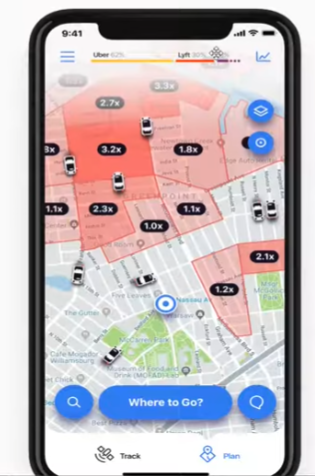
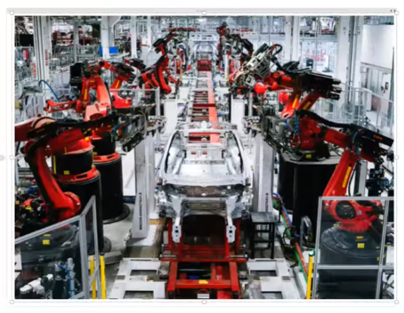

# Day 8 : Application of ML

--------------------

###  If you're not paying for the product, then you are the product.

## 1. Retail - Amazon/D-mart

- Big billion day in the flipkart.
- it will have around 5,6 core products.
- on sale, we have kept the which product stock high and which product stock low.

- here we train the ML model on the basis of previous years of data.
- based on this, we predict which product will be in demand and which product will not be in demand.
 ---------

-  Another way the Retailer user the Ml is.
- At the time of billing, they ask your mobile number.
- They create the profile of the customer on the basis of previous purchase history.
- They can sell the information to the third party.
- They can send the promotional message to the customer.

- Ex : Jonny is the customer of the Retailer.
- So, the retailer can send the promotional message of GYM product to Jonny.
- So, the chances of buying the product by Jonny are high.
- So, the retailer can increase the sales of the product.

- Retailers can Sell  the data to the GYM owner.
- So, the GYM owner can send the promotional message to Jonny.

## 2. Banking and Finance

- when we apply for the loan, the bank will check our credit score.
- The credit score is calculated on the basis of our previous transaction history.
- bank can predict whether we will repay the loan or not.
- The bank will check our previous transaction history and decide whether to give the loan or not.
- The bank will also decide the interest rate on the basis of our credit score.

## 3. Transportation - Uber/Ola

- if you observe the image, it shows the demand and supply of the cab.
- when the driver goes in that region as per the marking, it will provide you the high price.

-  How we create these markings ? 
  
  - we collect the data of the users in which in this particular time region like office time, the demand for the cab is high.
  - we collect the data of the users in which in this particular time region like nighttime.
    

## 4. Manufacturing - Tesla

- Tesla is the company which is making the self-driving car.
- Tesla is using the ML model to make the self-driving car.
- Tesla is using the ML model to predict the obstacle in front of the car.
- Tesla is using the ML model to predict the traffic signal.
- Tesla is using the ML model to predict the lane.

## 5. Social Media - Twitter/Facebook/Instagram

- when we open Facebook, it will show the news feed.
- it will show the news feed on the basis of our previous activity.
- it will show the news feed on the basis of our previous likes and comments.
- it will show the news feed on the basis of our previous shares.
- it will show the news feed on the basis of our previous friends.
- it will show the news feed on the basis of our previous groups.
